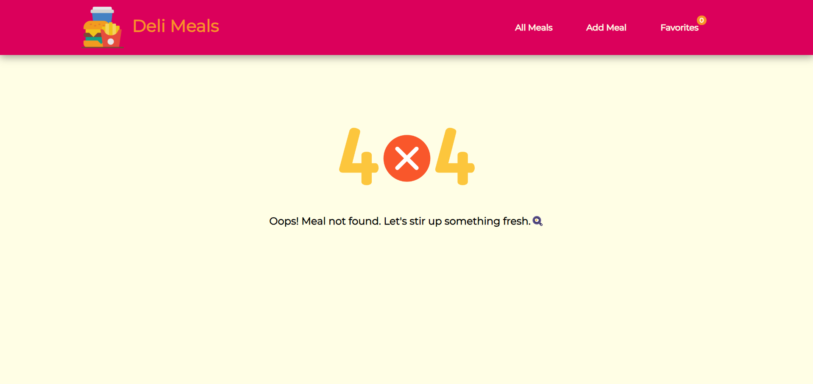

# Deli Meals App

Deli Meals application used to store different types of meals data in Firebase Realtime Database and add specific meals as favorites.

## Steps

1. Clone the repository

```
https://github.com/EziOPratikk/Meals-App-React-with-TypeScript-.git
```

2. Get node_modules

```
npm install
```

3. Run the project

```
npm start
```

## Ant Design

Following are the components taken from Ant Design library:

1. [Notification](https://ant.design/components/notification)

2. [Spin](https://ant.design/components/spin)

3. [Popconfirm](https://ant.design/components/popconfirm)

## Screenshots


