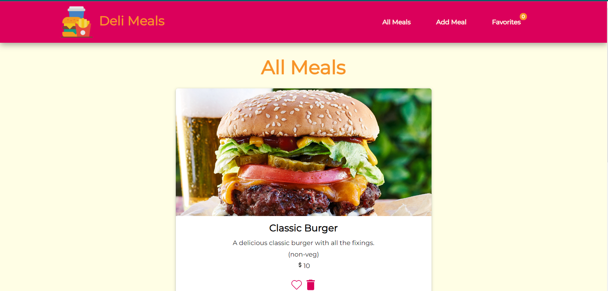
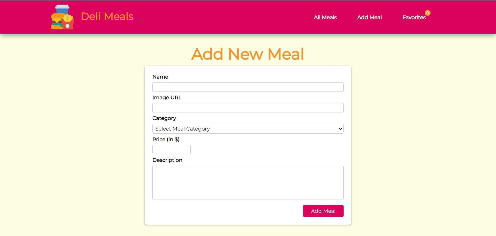
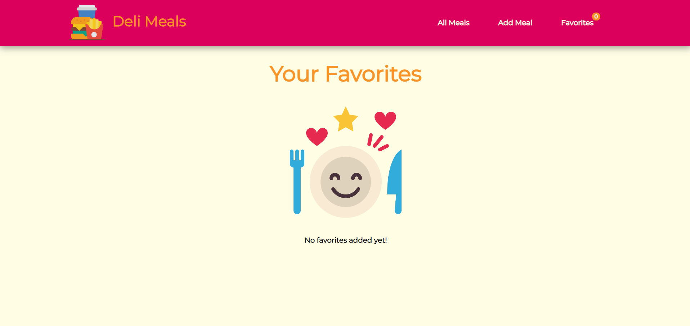

# Deli Meals App

Deli Meals application used to store different types of meals data and add as favorites.

## Steps

1. Clone the repository

```
https://github.com/EziOPratikk/Meals-App-React-with-TypeScript-.git
```

2. Get node_modules

```
npm install
```

3. Run the project

```
npm start
```

## Screenshots



